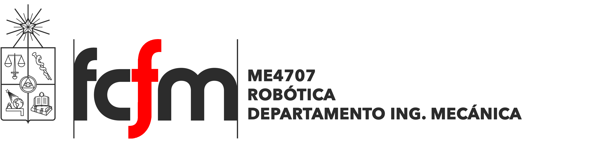

Este repositorio contiene los talleres prácticos y el material complementario del curso ME4707 Robótica.

## Google Colab
Para la realización de los talleres prácticos de programación del curso, es conveniente que todos utilizemos la misma plataforma y así podamos evitar errores de compatibilidad o de instalación. [**Google Colaboratory**](https://colab.research.google.com/notebooks/welcome.ipynb) es un entorno de Jupyter notebook gratuito que se ejecuta completamente en la nube. La plataforma permite tanto escribir como ejecutar código, y solo se requiere de una cuenta google.

https://colab.research.google.com/notebooks/welcome.ipynb

Dentro de este repositorio podrá encontrar los notebooks (\*.ipynb) de los distintos workshops a realizar a lo largo del curso. Descárguelos y ábralos dentro de su propia sesión de Colab.

## Clonar GitHub
En caso de requerir importar archivos y/o elementos de este repositorio a un entorno de Google Colab, puede clonarlo directamente mediante:

`! git clone https://github.com/RaimundoLorca/roboticafcfm2021-2.git`

Si el repositorio se ha clonado correctamente, notará que en la carpeta de archivos `/content` se habrá creado el directorio `roboticafcfm2021-2`. Para utilizar este directorio dentro de la sesión, utilice el siguiente comando:

`%cd /content/roboticafcfm2021-2`

## Tutorial Numpy
Numpy es quizás la librería más utilizada en lo que respecta a Python, se utiliza extensamente en la ciencia de datos y, más importante para el curso, en el procesamiento de imágenes. Fundamentalmente, está orientada a la manipulación de arreglos multidimensionales, para lo cual cuenta con estructuras de datos y operaciones especializadas. En este tutorial aprenderá las funcionalidades básicas de esta librería que le permitirán abordar los próximos workshops del curso.

## Auxiliar 1: Color Segmentation
La segmentación, si bien bajo muchos aspectos consiste en una operación bastante simple, es un proceso bastante útil a la hora de desarrollar algoritmos de detección de objetos o tracking. En términos simples, segmentar una imagen consiste en seccionar o aislar zonas de una imagen en función de algún atributo, como por ejemplo, intensidad o color. En este tutorial aprenderá los primeros pasos en cuanto a procesamiento de imágenes, desde cargar las imágenes como arreglos numéricos, hasta manipular sus valores mediante filtros y segmentadores. (Clickear la imagen para acceder al video de la auxiliar)

## Auxiliar 2: Shape Detection
La Transformada de Hough es una técnica que permite detectar geometrías en una imagen, mientras esta pueda ser parametrizada matemáticamente. Mediante su matriz acumuladora de votos, logra detectar recta y círculos incluso si estos presentan ruido o irregularidades. En este worshop utilizaremos las implementaciones de la Transformada de Hough en OpenCV para trackear y orientar un cuaderno en una imagen. (Clickear la imagen para acceder al video de la auxiliar)

## Auxiliar 3: Feature Detection
El Scale-Invariant Feature Transform (SIFT) es un algoritmo, desarrollado por D. Lowe en 2004, para la extracción de `features` de una imagen. En un sentido abstracto, las `features` de una imagen son patrones o regiones fácilmente detectables y trackeables, a partir de las cuales podemos identificar y reconocer toda de objetos presentes en la imagen. En este workshop utilizaremos la implementación de SIFT en OpenCV para identificar cartas Pokemon en una foto, a partir de una serie de cartas de referencia. (Clickear la imagen para acceder al video de la auxiliar)

## Auxiliar 4: Genetic Algorithms

Los algoritmos genéticos (GA) son una heurística de optimización, inspirada en la evolución biológica, donde los problemas pasan a ser modelados como la simulación de una población de individuos. Durante estas simulaciones, los indiviudos son sometidos a los principios fundamentales de la Teoría de Darwin como la heredabilidad genética, la recombinación genética aleatoria (mutaciones) y la supervivencia de los más aptos (selección natural). En este workshop implementaremos un algoritmo genético utilizando la librería especializada pyevolve para resolver un problema de maximización multivariable. (Clickear la imagen para acceder al video de la auxiliar)

## Auxiliar 5: Neuroevolving of Augmenting Topologies (NEAT)

Entre los algoritmos más comunes dentro del Machine Learning, se encuantran las ya bastante conocidas Rede Neuronales o Neural Networks (NN) que consisten en arquitecturas bioinspiradas en la forma en que nuestros cerebros procesan información mediante la transmisión paralela y secuencial de señales eléctricas, entre las neuronas. Así, las Redes Neuronales consisten en una red de nodos, generalmente ordenados por capas, que mediante una serie de ponderaciones y conexiones convierten una serie de valores de entrada (input) en una serie de valores de salida (output).

En este workshop nos concentraremos en el campo del aprendizaje no supervizado y en particular, en el Reinforcement Learning. En el Reinforcement Learning, las Redes Neuronales son entrenadas (ajustan sus parámetros) para resolver una tarea específica mediante prueba y error, de la misma manera en que uno entrena un animal con recompensas ante aciertos y castigos ante equivocaciones. Una implementación directa de esta idea es la Neuroevolución donde los algoritmos evolutivos son combinados con Redes Neuronales para evolucionar una arquitectura de Red Neuronal capaz de cumplir con la tarea objetivo.

